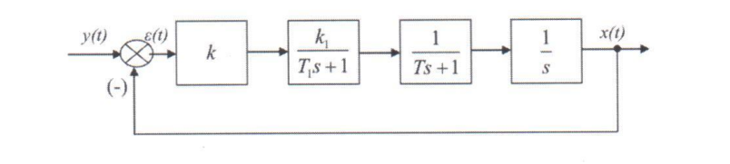

# Лабораторная работа №4
## «Исследование устойчивости САУ по критерию Михайлова»

## Цель работы
Экспериментальное построение областей устойчивости линейных САУ и изучение влияния на устойчивость системы ее параметров.

## Указания к самостоятельной работе

При подготовке к данной лабораторной работе необходимо изучить тему «Устойчивость систем автоматического управления»

## Исходные данные
```
T1 = 0.7
k1 = 1.6
Ta1 = 0.7
ka1 = 0.1
Ta2 = 1.7
ka2 = 3.0
```
Начальные условия
```
T = 0.1
k = 0
```
Диапазон изменения постоянной времени Т – от 0.1 до 5.0 сек.

## Порядок выполнения работы
1. Получить передаточную функцию по заданной структурной схеме линейной САУ (см. рисунок 1).
<div align="center">



###### Рисунок 1 Структурная схема линейной САУ

</div>

2. Построить годограф Михайлова при заданных начальных условиях.
3. Подобрать такое значение коэффициента усиления K (изменяя значение T), при котором система будет находиться на границе устойчивости, т.е. `K = Kkp`.
4. Построить границу области устойчивости, реализуя зависимость `Kkp = f(T)` (количество точек значений T для построения графика – не менее 12).
5. На графике границы устойчивости взять три точки: выше границы, ниже границы и на границе устойчивости и рассмотреть характеристики полученных систем. Построить для каждой из точек: переходную характеристику (с помощью функции step), импульсную (с помощью функции impulse), диаграмму Боде, годограф Найквиста.

## Содержание отчета:

1. Цель работы
2. Порядок выполнения работы
3. Результаты работы должны содержать:
    - структурную схему и передаточные функции системы,
    - листинги для каждого шага выполняемой работы,
    - годограф Михайлова при `K = 0` и `K = Kkp`,
    - таблицу расчетов графика границы устойчивости,
    - результаты моделирования системы (по 4 графика) для каждой из трех  точек:  выше, ниже и на границе устойчивости.
4. Выводы.

