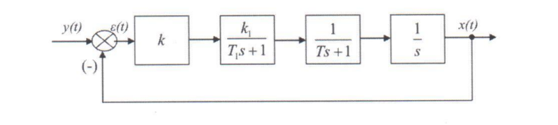

# Лабораторная работа №5
## «Описание дискретных систем в математическом пакете MatLab»
## Цель работы
Получить описание непрерывной системы в виде дискретной системы, используя функционал математического пакета MATLAB.
Работа выполняется в среде Simulink математического пакета MATLAB и в рабочем окне пакета MATLAB.

## Порядок выполнения работы

1. Получить передаточную функцию разомкнутой системы.

    

2. Получить описание системы в дискретном представлении. Осуществить преобразование непрерывной заданной модели системы в дискретную с помощью с2d с различными параметрами:
    - дискретную модель для экстраполяции нулевого порядка (сравнить с помощью графиков непрерывный и дискретный сигналы);
    - дискретную модель в представлении по методу билинейно аппроксимации Тастина (сравнить с помощью графиков непрерывный  и дискретный сигнал с билинейной аппроксимацией Тастина);
    - сравнить непрерывный сигнал с двумя видами дискретного сигнала – с экстраполяцией нулевого порядка и билинейной аппроксимацией Тастина ( на одном графике построить все кривые , выбрав следующие цвета: непрерывный сигнао –синий, с экстраполяцией нулевого порядка – черный, с аппроксимацией Тастина – красный)
    - дискретную модель с задержкой по времени с экстраполяцией нулевого порядка (принять задержку  равной 2 секундам) – сравнить на одном графике дискретный сигнал без задержки (красный) и дискретный сигнал с задержкой (зеленый).

3. С помощью среды Simulink получить переходные процессы в непрерывной и дискретной системах.

## Исходные данные
```
Т1 = 0.7
K1 = 1.6
K = 1
T = 0.1
```
Интервал времени t=25 с

Задержка дискретного сигнала – 2 с

## Содержание отчета
- ход работы
- листинг 1 с исходными данными
- структурная схема замкнутой дискретной системы, передаточная функция системы
- график переходной характеристики системы
- график импульсной переходной функции
- листинг 2- описание системы в дискретном представлении для экстраполяции нулевого порядка
- структурная схема системы с экстраполятором нулевого порядка
- графики сравнения непрерывного сигнала и дискретного с экстраполятором нулевого порядка
- листинг 3 - описание системы в дискретном представлении по методу билинейной аппроксимации Тастина
- структурная схема системы с билинейной аппроксимацией Тастина
- графики сравнения непрерывного сигнала и дискретного с билинейной аппроксимацией Тастина
- структурная схема системы сравнения непрерывного сигнала с экстраполяцией нулевого порядка и с билинейной аппроксимацией Тастина (действуют одновременно)
- графики сравнения непрерывного сигнала и дискретных с экстраполятором нулевого порядка и билинейной аппроксимацией Тастина
- структурная схема для моделирования системы с задержкой по времени
- график результатов моделирования с задержкой
- выводы по результатам моделирования

----

* Примечание: структурная схема из 3 и 4 лаб
