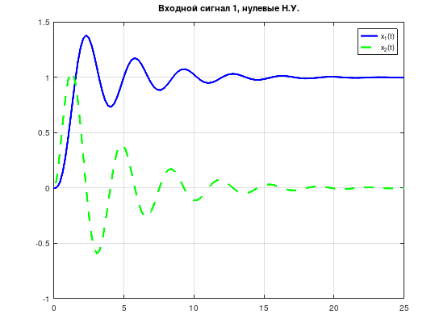
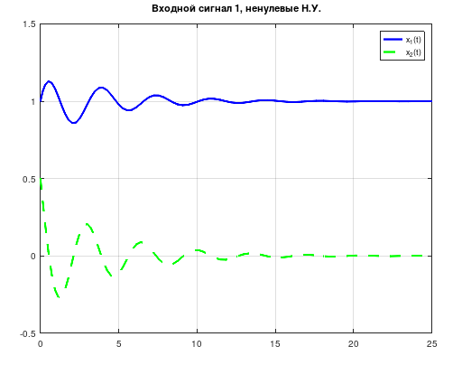
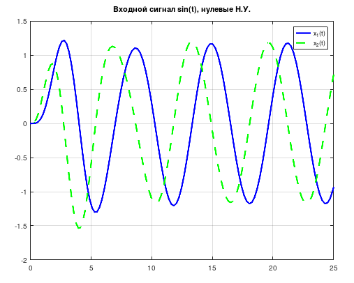
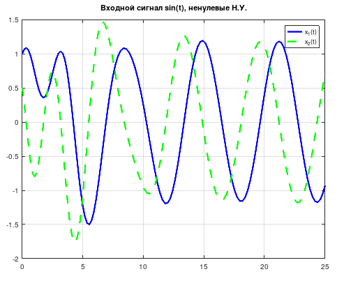

Отчёт Лабораторной работе №1
«Исследование динамики линейных систем, описываемых ОДУ»

# Цель работы

Ознакомиться с пакетом моделирования MatLab. Освоить основные приемы моделирования САУ, описываемых при помощи обыкновенных дифференциальных уравнений.

# Порядок выполнения работы

4. Ознакомиться с пакетом прикладных программ MatLab .
4. Записать дифференциальное уравнение по исходным данным.
4. Получить систему в нормальной форме Коши.
4. Осуществить моделирование системы дифференциальных уравнений в математическом пакете MatLab, используя численный метод интегрирования Рунге-Кутта и задавая н.у. векторами.
4. Проанализировать системы при двух видах входных воздействий : u = 1(t) и u = 2 sin(t).
 На дисплей выводить графики сигналов Х1(t) и Х2(t). Продолжительность интервалов наблюдения выбрать равной Т=25 с.
4. Осуществить моделирование свободного движения системы с нулевыми и ненулевыми начальными условиями.

# Исходные данные

| n |   a1 |  a2 |   a3|  a0 |  b0 |
|---|------|-----|-----|-----|-----|
| 3 |   4  |   2 |  1  |  5  |  5  |

|  n  |  x(0) | x'(0) | x''(0) |
|-----|-------|-------|--------|
|  3  |   1   |   0.5 | -1     |

# Ход работы

Вследствие отсутствия лицензии на использование пакета Matlab работа была выполнена в пакете GNU Octave, который имеет практически совместимый синтаксис.

## Математическая модель динамической системы

Уравнение будет выглядеть следующим образом ():

```formula
a_3 x^(3)(t) + a_2 x^(2)(t) + a_1 x^(1)(t) + a_0 x(t) = b_0 y(t)
```

Если произвести замену ():

```
x_1(t) = x(t)
x_2(t) = x_1^(1)(t)
x_3(t) = x_2^(1)(t)
```

То его можно представить в виде системы ():

```
x_1^(1)(t) = x_2(t)
x_2^(1)(t) = x_3(t)
x_3^(1)(t) = 1 over a_3 (b_0 y(t) - a_2 x_3(t) - a_1 x_2 (t) - a_0 x_1(t))
```

Если подставить коэффициенты, то система примет вид ():
```
x_1^(1)(t) = x_2(t)
x_2^(1)(t) = x_3(t)
x_3^(1)(t) = 1 over a_3 (b_0 y(t) - a_2 x_3(t) - a_1 x_2 (t) - a_0 x_1(t))
```

# Моделирование в математическом пакете

Коэффициенты инициализируются в подпрограмме, представленной в листинге 1.

Листинг 1 - Инициализация переменных

```
% Copyright 2022 Fe-Ti aka T.Kravchenko
n = 3;
a0 = 5;
a1 = 4;
a2 = 2;
a3 = 1;
b0 = 5;

x_zero = [0, 0, 0];
x_nonzero = [ 1, 0.5, -1];
```

Для моделирования системы была написан файл-функция (см. Листинг 2). В качестве входных данных используются параметры:

- t - время;
- x - вектор размерности 3;
- y - функция входного сигнала.

Листинг 2 - Модель системы

```
function xp = model(t, x, y)
% Copyright 2022 Fe-Ti aka T.Kravchenko
% x - vector of length 3
% y - some anonymous function, e.g. @(t) sin(t)
% t - time
init_variables;
disp(t);
xp = zeros(3, 1);

s_in = y(t);
xp(1) = x(2);
xp(2) = x(3);
xp(3) = b0 * s_in - a2 * x(3) - a1 * x(2) - a0 * x(1);
```

Построение графиков производилось в основном скрипте, показанном в листинге 3.
Стиль линий графиков определён в явном виде.

Листинг 3 - Основной скрипт

```
% Copyright 2022 Fe-Ti aka T.Kravchenko

% Initializing stuff

init_variables;

T = 25 % seconds

ode_opts = odeset('AbsTol',[1e-5,1e-5,1e-5],'RelTol',1e-5);

y_1 = @(t) 1;
y_sin = @(t) sin(t);

model_1 = @(t, x) model(t, x, y_1);
model_sin = @(t, x) model(t, x, y_sin);

% Plotting beautiful plots

% input signal is 1, zero initial conditions
[time, x] = ode45(model_1, [0, T], x_zero, ode_opts);
figure;
plot(time, x(:,1), 'b-', time, x(:,2), 'g--', 'LineWidth', 2);
legend('x_1(t)','x_2(t)');
grid on;

% input signal is 1, nonzero initial conditions
[time, x] = ode45(model_1, [0, T], x_nonzero, ode_opts);
figure;
plot(time, x(:,1), 'b-', time, x(:,2), 'g--', 'LineWidth', 2);
legend('x_1(t)','x_2(t)');
grid on;

% input signal is sin(t), zero initial conditions
[time, x] = ode45(model_sin, [0, T], x_zero, ode_opts);
figure;
plot(time, x(:,1), 'b-', time, x(:,2), 'g--', 'LineWidth', 2);
legend('x_1(t)','x_2(t)');
grid on;

% input signal is sin(t), nonzero initial conditions
[time, x] = ode45(model_sin, [0, T], x_nonzero, ode_opts);
figure;
plot(time, x(:,1), 'b-', time, x(:,2), 'g--', 'LineWidth', 2);
legend('x_1(t)','x_2(t)');
grid on;
```

При запуске программы выводятся графики со следующими параметрами:

- нулевые начальные условия (далее НУ), единичное воздействие (см. рисунок %%%1);
- единичное воздействие, ненулевые НУ (см. рисунок %%%2);
- синусоидальное воздействие, нулевые НУ (см. рисунок %%%3);
- синусоидальное воздействие, ненулевые НУ (см. рисунок %%%4).






# Выводы

В ходе работы был изучен синтаксис пакета моделирования MatLab. Помимо этого были рассмотрены основные приемы моделирования САУ, описываемых при помощи обыкновенных дифференциальных уравнений, и пример такого моделирования.

Также рассмотренные приёмы были реализованы в форме программы для пакетов Matlab и GNU Octave.
