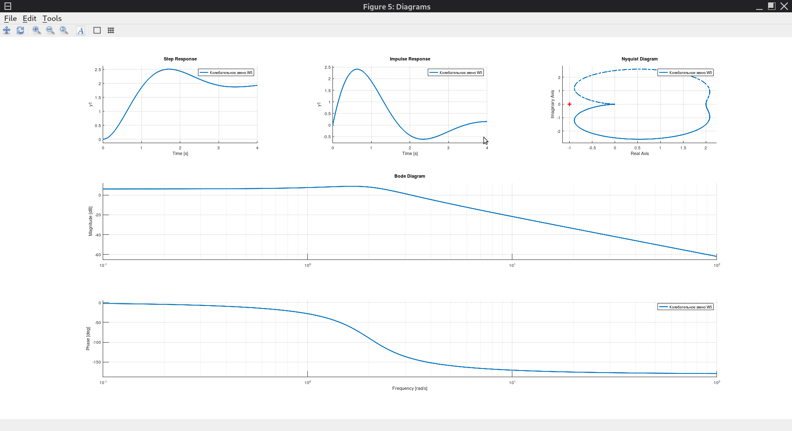

Отчёт Лабораторной работе №2
# Цель работы

Исследование переходных характеристик и  динамических свойств типовых звеньев систем автоматического управления.

# Порядок выполнения работы

1. Код, реализующий моделирование  и сохранение характеристик звеньев, для всех заданий реализовать в скрипте lab_otu_dynamic.m., код для каждого звена представить в виде листинга с соответствующим номером передаточной функции и типа звена.
2. Осуществить моделирование и сохранить временные и частотные характеристики  типовых динамических звеньев.
o

# Задание

Параметры, приведённые ниже, одинаковы для всех звеньев:

```matlab
K = 2
T = 0.5
ksi = 0.4
```

Все передаточные функции каждого из типовых звеньев формировать с помощью команды `tf`, задавая полином знаменателя и числителя :

```
Wi(s) = Х(s)/Y(s) = B(s) / A(s)

# OO/LO formula markup
W_i(s) = X(s) over Y(s) = B(s) over A(S)
```

Реализовать звенья (W.(s) - номер функции в исх.текстах):

- усилитель (пропорциональное звено) W1(s);
- интегрирующее звено W2(s);
- апериодическое 1-го порядка W3(s);
- реальное дифференцирующее 1-го порядка W4(s);
- колебательное с исходными  значениями К, T и %ksi W5(s);
- колебательное со значением К1 = К*2 W6(s);
- колебательное со значением Т1 = Т*2 W7(s);
- колебательное с уменьшением коэффициента деммпфирования вдвое W8(s);
- консервативное звено (колебательное со значением коэффициента демпфирования равным 0) W9(s).

Для каждого из динамических звеньев построить на одной канве пять графиков:

- график переходного процесса на единичное ступенчатое воздействие (переходная функция), построенный с использованием функции `step()`, для которой в явном виде задать время моделирования равное 4с;
- график переходного процесса на единичное импульсное воздействие (весовая функция), построенный с использованием функции `impulse()` для которой в явном виде задать время моделирования равное 4с;
- графики ЛАФЧХ (диаграммы Боде), построенные с использованием функции `bode()` для амплитуды и фазы (в обязательном порядке на графиках ЛАФЧХ частоту отобразить в Гц (рад/с), ЛАЧХ в дБ, а ЛФЧХ в градусах), масштаб логарифмический;
- годограф Найквиста (АФЧХ в полярных координатах) на комплексной плоскости.

# Требования к содержанию отчёта

1. для каждого динамического звена привести графики (со всеми подписями и легендой)
2. сделать выводы относительно зависимости характера переходных процессов и ЛАФЧХ от параметров передаточной функции каждого типа динамических звеньев, а также относительно динамики (вида переходного процесса) и особенностей каждого типа динамических звеньев
3. сделать выводы о влиянии параметров на характеристики колебательного звена
4. провести сравнительный анализ результатов моделирования.

# Ход работы

Вследствие отсутствия лицензии на использование пакета Matlab работа была выполнена в пакете GNU Octave, который имеет практически совместимый синтаксис.


# Моделирование в математическом пакете

Передаточные функции инициализируются в программе, представленной в листинге 1. Данная программа является универсальной и способна работать как в GNU Octave, так и в Matlab.

Листинг 1 - Основной скрипт

```
% Copyright 2022 Fe-Ti aka T.Kravchenko

isOctave = exist('OCTAVE_VERSION', 'builtin') ~= 0; % detecting type of CAS
isMatlab = not(isOctave);
if isOctave
    pkg load control;
end

K = 2
T = 0.5
ksi = 0.4
modelling_time = 4

% Note:
%
% If the script fails in GNU Octave with control package v3.x.x,
% you should replace some 'error' commands with 'warning' commands in:
%   - @lti/c2d.m in check for discrete-time (add return statement before end)
%   - @imp_invar.m in check for order
% Otherwise plotting w1 and w4 may not work (cause of step() and impulse()).
%

% TF for links:
% amp.
w1 = tf(K, 'Name', 'Усилитель W1')
plot_diagrams(w1, modelling_time)

% intg.
w2 = tf(K, [1, 0], 'Name', 'Интегрирующее звено W2')
plot_diagrams(w2, modelling_time)

% 1-Ord aper.
w3 = tf(K, [T, 1], 'Name', 'Апериод. звено 1-го пор. W3')
plot_diagrams(w3, modelling_time)

% 1-Ord real diff.
num = [K, 0]
den = [T, 1]
w4 = tf(num, den, 'Name', 'Реальное диф. звено 1-го пор. W4')
plot_diagrams(w4, modelling_time)

% osc. (checkout the README.md)
num = K;
den = [T*T, 2*T*ksi, 1];
w5 = tf(num, den, 'Name', 'Колебательное звено W5')
plot_diagrams(w5, modelling_time)

num = K * 2;
den = [T*T, 2*T*ksi, 1];
w6 = tf(num, den, 'Name', 'Колебательное звено W6 (K*2)')
plot_diagrams(w6, modelling_time)

num = K;
T1 = T * 2;
den = [T1*T1, 2*T1*ksi, 1];
w7 = tf(num, den, 'Name', 'Колебательное звено W7 (T*2)')
plot_diagrams(w7, modelling_time)

num = K;
den = [T*T, 2*T*ksi*2, 1];
w8 = tf(num, den, 'Name', 'Колебательное звено W8 (ksi*2)')
plot_diagrams(w8, modelling_time)

num = K;
den = [T*T, 0, 1];
w9 = tf(num, den, 'Name', 'Консервативное звено W9 (ksi=0)')
plot_diagrams(w9, modelling_time)
```

Построение графиков реализовано в специальной функции, которая строит по пять графиков согласно заданию. При передаче в качестве параметра sys cell-массива из линейных систем данный скрипт отобразит несколько графиков в одних и тех же осях. В случае использования пакета GNU Octave для отображения диаграмм Боде будет использована специальная функция, так как функция bode() в модуле для этой системы компьютерной алгебры строит графики на жестко-определённых позициях, перезаписывая предыдущие характеристики.

Листинг 2 ‒ Функция для построения графиков

```
function sucsess=plot_diagrams(sys, modelling_time, name)
% Copyright 2022 Fe-Ti aka T.Kravchenko
    isOctave = exist('OCTAVE_VERSION', 'builtin') ~= 0; % detecting type of CAS
    isMatlab = not(isOctave);
    if isOctave
        pkg load control;
    end

    if (nargin < 3)
        name = "Diagrams";
    end

    if (~iscell(sys))
        sys = {sys};
    end

    r = 3;
    c = 3;
    step_tiles = 1;
    impulse_tiles = 2;
    nyquist_tiles = 3;
    mag_tiles = [4:6];
    pha_tiles = [7:9];

    % new figure with awesome name
    figure('Name', name);

    % legend is just system names
    lg = cellfun (@get, sys, {'Name'}, "uniformoutput", false);

    if isOctave
        % workaround for Octave's control package
        [m p w] = cellfun (@bode, sys, "uniformoutput", false);
        plot_bode(m, p, w, r, c, mag_tiles, pha_tiles);
        legend(lg{:});
    else
        subplot(r, c, [mag_tiles pha_tiles]);
        hold on
        cellfun (@bode, sys);
        legend(lg{:});
        hold off
    end

    subplot(r, c, step_tiles); % row, col, index;
    hold on
    step(sys{:}, modelling_time);
    legend(lg{:});
    hold off

    subplot(r, c, impulse_tiles); % row, col, index;
    hold on
    impulse(sys{:}, modelling_time);
    legend(lg{:});
    hold off

    subplot(r, c, nyquist_tiles); % row, col, index;
    hold on
    nyquist(sys{:});
    legend(lg{:});
    hold off

    success = 1;
end
```

В листинге 3 приведена функция, которая нужным образом строит диаграммы Боде в пакете GNU Octave. Данный скрипт работает лишь в GNU Octave, так как он использует функции, которые специфичны данному ПО.

Листинг 3 ‒ Функция для корректного отображения диаграмм Боде

```
function success = plot_bode(m, p, w, r, c, mag_tiles, pha_tiles)
% Copyright 2022 Fe-Ti aka T.Kravchenko
    if (nargin < 4)
        r = 2;
        c = 1;
        mag_tiles = 1;
        pha_tiles = 2;
    end

    if (~iscell(m))
        m = {m}
    end

    if (~iscell(p))
        p = {p}
    end

    if (~iscell(w))
        w = {w}
    end

    % based on bode.m from control package
    mag_db = cellfun (@mag2db, m, "uniformoutput", false);

    subplot(r, c, mag_tiles); % row, col, index;
    hold on
    cellfun (@semilogx, w, mag_db)
    hold off
    axis ("tight")
    ylim (__axis_margin__ (ylim))
    grid ("on")
    ylabel ("Magnitude [dB]")

    subplot(r, c, pha_tiles);
    hold on
    cellfun (@semilogx, w, p)
    hold off
    axis ("tight")
    ylim (__axis_margin__ (ylim))
    grid ("on")
    xlabel ("Frequency [rad/s]")
    ylabel ("Phase [deg]")
    success = 1;
end
```

Все приведённые выше исходные тексты позволяют строить графики функций, при этом:

- W1(s) показана на рисунке %%%1;
- W2(s) - на рисунке %%%2;
- W3(s) - на рисунке %%%3;
- W4(s) - на рисунке %%%4;
- W5(s) - на рисунке %%%5;
- W6(s) - на рисунке %%%6;
- W7(s) - на рисунке %%%7;
- W8(s) - на рисунке %%%8;
- W9(s) - на рисунке %%%9.





# Выводы

В процессе выполнения работы были исследованы переходные характеристики и динамические свойства типовых звеньев САУ.

Если анализировать полученные графики, то можно заметить

При этом 

2. сделать выводы относительно зависимости характера переходных процессов и ЛАФЧХ от параметров передаточной функции каждого типа динамических звеньев, а также относительно динамики (вида переходного процесса) и особенностей каждого типа динамических звеньев
3. сделать выводы о влиянии параметров на характеристики колебательного звена
